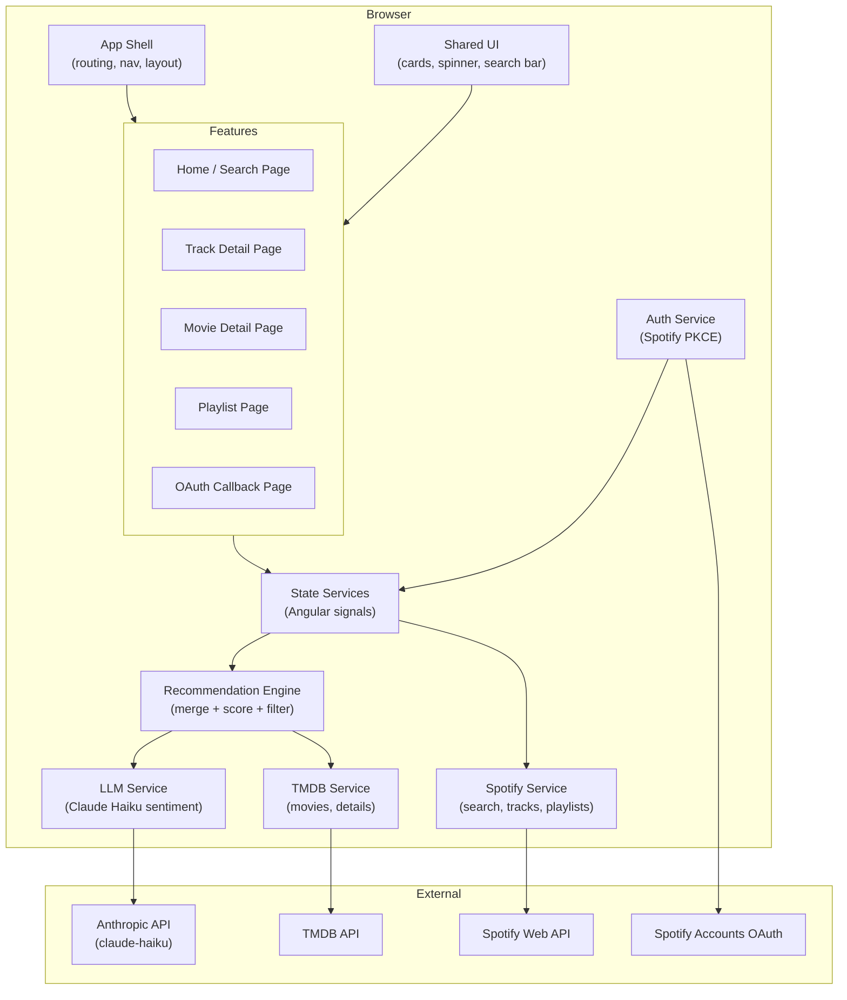
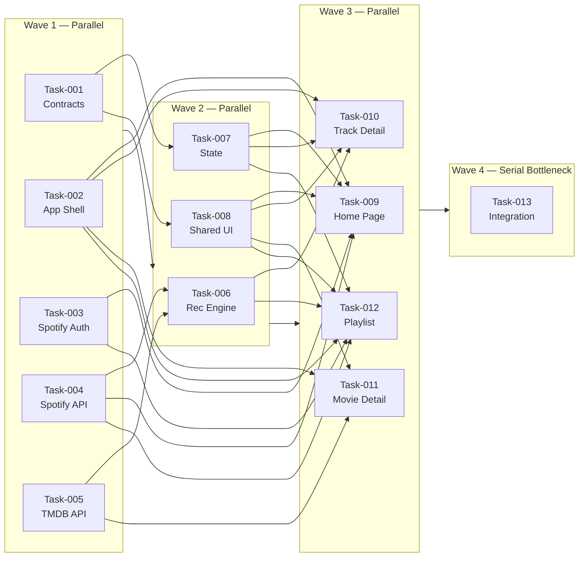

# PROJECT_SPEC.md — Soundtrack Cinema v2

> This spec drives parallel subagent development. All contracts in `/spec/contracts/`
> are READ-ONLY. No subagent may modify them without orchestrator approval.

---

## 1. Overview

### What the App Does

**Soundtrack Cinema** bridges music and film: users search for any Spotify song, and the
app surfaces movies that share the same emotional DNA — either because the song literally
appeared on the soundtrack, or because the mood, genre, and sentiment match what the
movie evokes. The results are powered by a combination of TMDB keyword search and an
optional Claude AI sentiment analysis layer.

### Target Users & Core Use Cases

| User type | Core use case |
|---|---|
| Music lover | "I heard this song — what movie has a similar vibe?" |
| Movie buff | Discover films through musical mood matching |
| Playlist curator | "What movies would pair with this playlist?" |
| Casual user | Browse top Spotify tracks and see matching films |

### Success Criteria ("Done" Looks Like)

- [ ] User can log in with Spotify via PKCE OAuth flow
- [ ] User can search Spotify tracks and see results with album art
- [ ] Clicking a track shows a page of movie recommendations, sorted by relevance
- [ ] Movie recommendations are filtered to TMDB `vote_average ≥ 6.0`
- [ ] User can view a movie detail page with full info and a link to IMDB
- [ ] User can select a Spotify playlist and get aggregated movie recommendations
- [ ] LLM (Claude Haiku) sentiment layer augments TMDB results when API key is set
- [ ] App is fully accessible: keyboard navigable, ARIA live regions, focus management
- [ ] App works without a Spotify account (TMDB movie browsing still available)

---

## 2. App UI & Experience

### Design Principles

- **Cinematic dark theme** — deep navy/black backgrounds, warm amber accent, rich poster imagery
- **Music-first search** — search bar is the hero element, always prominent
- **Progressive disclosure** — unauthenticated users see the home page; auth prompts only when they try to search Spotify
- **Fast feedback** — skeleton loaders during API calls; no blank-screen waits
- **Mobile-first** — responsive grid, touch-friendly tap targets

### Design Tokens (CSS Custom Properties — defined in `src/styles.css`)

```css
--color-bg-primary: #0d1117;
--color-bg-secondary: #161b22;
--color-bg-card: #1c2128;
--color-accent: #f5a623;
--color-accent-hover: #fbbf24;
--color-text-primary: #e6edf3;
--color-text-secondary: #8b949e;
--color-border: #30363d;
--color-success: #3fb950;
--color-error: #f85149;
--color-spotify: #1db954;
--border-radius-sm: 4px;
--border-radius-md: 8px;
--border-radius-lg: 16px;
--shadow-card: 0 4px 24px rgba(0, 0, 0, 0.4);
--font-family: 'Inter', system-ui, sans-serif;
--transition-fast: 150ms ease;
--transition-base: 250ms ease;
```

### Pages & Flows

#### `/` — Home Page

**Unauthenticated state:**
```
┌────────────────────────────────────────────────────────┐
│  🎬 Soundtrack Cinema                    [Connect Spotify] │
├────────────────────────────────────────────────────────┤
│                                                        │
│        Discover movies through music                   │
│                                                        │
│   ┌──────────────────────────────────┐                 │
│   │ 🔍  Search songs...             │                 │
│   └──────────────────────────────────┘                 │
│         Connect Spotify to search                      │
│                                                        │
│  ── Popular Movies Right Now ──────────────────────   │
│  [poster] [poster] [poster] [poster] [poster]         │
│                                                        │
└────────────────────────────────────────────────────────┘
```

**Authenticated state:**
- Search bar is fully active
- Nav shows user avatar and "My Playlists" link
- Below search: "Your Top Tracks" horizontal scroll strip
- Live search results appear below bar as user types (debounced 300ms)
- Each track result: album thumbnail, track name, artist, duration

```
┌────────────────────────────────────────────────────────┐
│  🎬 Soundtrack Cinema    [@Username] [Playlists] [Logout] │
├────────────────────────────────────────────────────────┤
│   ┌──────────────────────────────────────┐             │
│   │ 🔍  Search songs or artists...      │             │
│   └──────────────────────────────────────┘             │
│   ┌──────────────────────────────────────┐             │
│   │ [art] Bohemian Rhapsody — Queen  3:55│             │
│   │ [art] Bohemian Rhapsody — Weezer 2:30│             │
│   └──────────────────────────────────────┘             │
│  ── Your Top Tracks ────────────────────────────────  │
│  [card] [card] [card] [card] [card] →                 │
└────────────────────────────────────────────────────────┘
```

#### `/callback` — Spotify OAuth Callback

- Invisible page; shows a loading spinner
- Reads `code` and `state` from URL params
- Validates state, exchanges code for tokens via Spotify `/api/token`
- On success: stores tokens in `sessionStorage`, navigates to `/`
- On error: navigates to `/` with error toast

#### `/track/:id` — Track Detail & Movie Recommendations

```
┌────────────────────────────────────────────────────────┐
│  ← Back       Soundtrack Cinema                        │
├────────────────────────────────────────────────────────┤
│  [Album Art]  Bohemian Rhapsody                        │
│    (200x200)  Queen · A Night at the Opera · 1975      │
│               ★ 89/100 popularity                      │
├────────────────────────────────────────────────────────┤
│  Movies that match this vibe              [Filter ▼]  │
│  Sort: [Relevance ▼]   Min Rating: [6.0 ▼]            │
│                                                        │
│  ┌─────────┐  ┌─────────┐  ┌─────────┐               │
│  │ poster  │  │ poster  │  │ poster  │               │
│  │ Title   │  │ Title   │  │ Title   │               │
│  │ ★ 7.8  │  │ ★ 8.1  │  │ ★ 6.5  │               │
│  │ 1984    │  │ 2001    │  │ 1999    │               │
│  │ [View]  │  │ [View]  │  │ [View]  │               │
│  └─────────┘  └─────────┘  └─────────┘               │
│                                                        │
│  🤖 AI-enhanced · Powered by emotional sentiment      │
└────────────────────────────────────────────────────────┘
```

- Loading state: animated skeleton cards while fetching
- AI badge shown only when LLM results are included
- "No results" state with helpful message and try-again button
- Filter dropdown: min rating 5.0 / 6.0 / 7.0 / 8.0
- Sort: Relevance (default), Rating, Year

#### `/movie/:id` — Movie Detail

```
┌────────────────────────────────────────────────────────┐
│  ← Back to results                                     │
├──────────────┬─────────────────────────────────────────┤
│              │  Bohemian Rhapsody (2018)               │
│   [Poster]   │  ⭐ 7.9 / 10  (13.4k votes)            │
│   (300x450)  │  Biography · Drama · Music              │
│              │  Runtime: 134 min                       │
│              │  ─────────────────────────────          │
│              │  The story of the legendary rock band   │
│              │  Queen and lead singer Freddie Mercury...│
│              │                                         │
│              │  [View on IMDB ↗]                       │
└──────────────┴─────────────────────────────────────────┘
│  ── You came from ──────────────────────────────────  │
│  [album art] Bohemian Rhapsody — Queen                │
│              [← Back to recommendations]              │
└────────────────────────────────────────────────────────┘
```

#### `/playlist` — Playlist Mode

```
┌────────────────────────────────────────────────────────┐
│  ← Home    Playlist Movie Finder                       │
├────────────────────────────────────────────────────────┤
│  Select a playlist to discover matching movies         │
│                                                        │
│  ┌──────────┐  ┌──────────┐  ┌──────────┐            │
│  │ [cover]  │  │ [cover]  │  │ [cover]  │            │
│  │ My Vibes │  │ Roadtrip │  │ Workout  │            │
│  │ 42 songs │  │ 28 songs │  │ 67 songs │            │
│  └──────────┘  └──────────┘  └──────────┘            │
│                                                        │
│  ── Selected: My Vibes ─────────────────────────────  │
│  [Track list preview — first 5 tracks shown]          │
│                                                        │
│  [ Find Movies for This Playlist ]                    │
│                                                        │
│  ── Results ───────────────────────────────────────  │
│  [movie card] ♫ matched by 8 tracks                  │
│  [movie card] ♫ matched by 5 tracks                  │
└────────────────────────────────────────────────────────┘
```

### Accessibility Requirements

- All interactive elements keyboard-navigable (Tab, Enter, Space, Escape)
- Search results announced via `AriaLiveAnnouncer` from `@angular/cdk/a11y`
- Loading states announced: "Loading movie recommendations..."
- Movie cards: `role="article"`, poster image has descriptive `alt`
- Nav: `role="navigation"`, skip-to-content link at top
- Modal/overlay focus trapped using `FocusTrap` from `@angular/cdk/a11y`
- Color contrast ≥ 4.5:1 for all text on background colors

---

## 3. System Architecture

### High-Level Diagram



### Module Descriptions

| Module | Responsibility |
|---|---|
| **App Shell** | Routing config, nav component, layout wrapper, global error boundary |
| **Auth Service** | Spotify PKCE OAuth flow: generate verifier, redirect, token exchange, refresh |
| **Spotify Service** | Typed HTTP client for all Spotify Web API endpoints |
| **TMDB Service** | Typed HTTP client for TMDB search, movie detail, popular movies |
| **Recommendation Engine** | Combines TMDB search + LLM suggestions, scores, deduplicates, filters by rating |
| **LLM Service** | Calls Anthropic API (claude-haiku) with song metadata, parses movie suggestion list |
| **State Services** | Domain-specific `providedIn: 'root'` singleton services — Zustand-style: public signals, computed derivations, and action methods flat on the class |
| **Shared UI** | Reusable components: MovieCard, TrackCard, LoadingSpinner, RatingBadge, SearchBar |
| **Home Feature** | Landing page: hero, search bar, live results, top tracks |
| **Track Detail Feature** | Track info + movie recommendations grid with filter/sort |
| **Movie Detail Feature** | Full movie overview with IMDB link |
| **Playlist Feature** | Playlist grid, track preview, aggregated recommendations |
| **Callback Feature** | OAuth redirect handler |

---

## 4. Contracts

All contracts live in `/spec/contracts/` and are READ-ONLY:

| File | Contents |
|---|---|
| `types.ts` | All shared TypeScript interfaces and types |
| `api.yaml` | OpenAPI 3.0 schema for Spotify + TMDB endpoints |
| `env.md` | All required environment variables with descriptions and template |

---

## 5. Module Breakdown & File Ownership

> **Rule:** No two agents own overlapping files. Each agent works exclusively in its assigned directories.

### Agent A — Contracts *(Task-001)*
- `spec/contracts/types.ts`
- `spec/contracts/api.yaml`
- `spec/contracts/env.md`

### Agent B — App Shell & Infrastructure *(Task-002)*
- `src/app/app.ts`, `src/app/app.html`, `src/app/app.css`
- `src/app/app.config.ts`, `src/app/app.routes.ts`
- `src/styles.css`
- `src/app/core/layout/shell.component.ts/.html/.css`
- `src/app/core/layout/nav.component.ts/.html/.css`
- `src/app/core/layout/index.ts`
- `src/environments/environment.ts`
- `src/environments/environment.prod.ts`

### Agent C — Spotify Auth *(Task-003)*
- `src/app/core/auth/spotify-auth.service.ts`
- `src/app/core/auth/auth.guard.ts`
- `src/app/core/auth/pkce.util.ts`
- `src/app/core/auth/index.ts`
- `src/app/features/callback/callback.component.ts/.html/.css`

### Agent D — Spotify API Service *(Task-004)*
- `src/app/services/spotify/spotify.service.ts`
- `src/app/services/spotify/spotify-http.interceptor.ts`
- `src/app/services/spotify/index.ts`

### Agent E — TMDB Service *(Task-005)*
- `src/app/services/tmdb/tmdb.service.ts`
- `src/app/services/tmdb/tmdb-image.pipe.ts`
- `src/app/services/tmdb/index.ts`
- `src/app/core/tokens/environment.token.ts`

### Agent F — Recommendation Engine *(Task-006)*
- `src/app/services/recommendation/recommendation.service.ts`
- `src/app/services/recommendation/llm.service.ts`
- `src/app/services/recommendation/recommendation.utils.ts`
- `src/app/services/recommendation/index.ts`

### Agent G — State Services *(Task-007)*
- `src/app/core/state/auth.state.ts`
- `src/app/core/state/search.state.ts`
- `src/app/core/state/recommendations.state.ts`
- `src/app/core/state/playlist.state.ts`
- `src/app/core/state/index.ts`

### Agent H — Shared UI *(Task-008)*
- `src/app/shared/components/movie-card/movie-card.component.ts/.html/.css`
- `src/app/shared/components/track-card/track-card.component.ts/.html/.css`
- `src/app/shared/components/loading-spinner/loading-spinner.component.ts/.html/.css`
- `src/app/shared/components/rating-badge/rating-badge.component.ts/.html/.css`
- `src/app/shared/components/search-bar/search-bar.component.ts/.html/.css`
- `src/app/shared/components/empty-state/empty-state.component.ts/.html/.css`
- `src/app/shared/pipes/duration.pipe.ts`
- `src/app/shared/index.ts`

### Agent I — Home Feature *(Task-009)*
- `src/app/features/home/home.component.ts/.html/.css`

### Agent J — Track Detail Feature *(Task-010)*
- `src/app/features/track-detail/track-detail.component.ts/.html/.css`

### Agent K — Movie Detail Feature *(Task-011)*
- `src/app/features/movie-detail/movie-detail.component.ts/.html/.css`

### Agent L — Playlist Feature *(Task-012)*
- `src/app/features/playlist/playlist.component.ts/.html/.css`

### Agent M — Integration *(Task-013)*
- Updates `src/app/app.config.ts` (adds HTTP client, interceptors, CDK providers)
- Updates `src/app/app.routes.ts` (wires all routes)
- `src/app/app.spec.ts` (smoke test)

---

## 6. Task List

See `/spec/tasks/` for detailed task files.

| ID | Title | Agent | Wave | Depends On |
|---|---|---|---|---|
| task-001 | Contracts & Types | A | 1 | — |
| task-002 | App Shell, Routing, Layout | B | 1 | — |
| task-003 | Spotify OAuth PKCE Auth | C | 1 | — |
| task-004 | Spotify API Service | D | 1 | — |
| task-005 | TMDB API Service | E | 1 | — |
| task-006 | Recommendation Engine + LLM | F | 2 | 004, 005 |
| task-007 | State Services | G | 2 | 001 |
| task-008 | Shared UI Components | H | 2 | 001 |
| task-009 | Home / Search Feature Page | I | 3 | 002, 003, 004, 007, 008 |
| task-010 | Track Detail Feature Page | J | 3 | 002, 006, 007, 008 |
| task-011 | Movie Detail Feature Page | K | 3 | 002, 005, 008 |
| task-012 | Playlist Feature Page | L | 3 | 002, 003, 004, 006, 007, 008 |
| task-013 | Integration Wiring | M | 4 | all |

---

## 7. Parallelization Plan



**Serial Bottleneck:** Task-013 is the only serial task — it wires all routes, providers,
and interceptors together after all features are implemented. It cannot be parallelized
because it depends on every other task's output.

**Wave Summary:**

| Wave | Tasks | Max Parallelism |
|---|---|---|
| 1 | 001, 002, 003, 004, 005 | 5 subagents |
| 2 | 006, 007, 008 | 3 subagents |
| 3 | 009, 010, 011, 012 | 4 subagents |
| 4 | 013 | 1 subagent |

---

## 8. Orchestrator Instructions

```
You are the orchestrator for building Soundtrack Cinema v2, an Angular 21 app.
Read PROJECT_SPEC.md and all files in /spec/contracts/ before starting.
The contracts are READ-ONLY — no subagent may modify them.

## Setup (before Wave 1)
Run: npm install @angular/cdk@^21.0.0 @anthropic-ai/sdk
This adds Angular CDK (for a11y) and Anthropic SDK (for LLM features).
Copy spec/contracts/env.md template to src/environments/environment.ts and
src/environments/environment.prod.ts — subagents will fill in their section.

## Wave 1 — Launch 5 subagents IN PARALLEL
Each subagent works ONLY in its owned directories (see Section 5 of PROJECT_SPEC.md).
- Agent A → /spec/tasks/task-001.md  (already done — contracts exist)
- Agent B → /spec/tasks/task-002.md  (app shell)
- Agent C → /spec/tasks/task-003.md  (spotify auth)
- Agent D → /spec/tasks/task-004.md  (spotify service)
- Agent E → /spec/tasks/task-005.md  (tmdb service)

After all 5 complete: run `ng build` and verify zero compilation errors.

## Wave 2 — Launch 3 subagents IN PARALLEL
- Agent F → /spec/tasks/task-006.md  (recommendation engine)
- Agent G → /spec/tasks/task-007.md  (state services)
- Agent H → /spec/tasks/task-008.md  (shared UI)

After all 3 complete: run `ng build` and verify zero compilation errors.

## Wave 3 — Launch 4 subagents IN PARALLEL
- Agent I → /spec/tasks/task-009.md  (home page)
- Agent J → /spec/tasks/task-010.md  (track detail)
- Agent K → /spec/tasks/task-011.md  (movie detail)
- Agent L → /spec/tasks/task-012.md  (playlist)

After all 4 complete: run `ng build` and verify zero compilation errors.

## Wave 4 — Launch 1 subagent
- Agent M → /spec/tasks/task-013.md  (integration wiring)

After completing: run `ng build && ng serve` and perform the smoke test:
1. App loads at http://localhost:4200
2. "Connect Spotify" button visible
3. Popular movies section loads
4. Routing works: /track/any-id shows track detail page (skeleton)
5. /movie/any-id shows movie detail page (skeleton)
6. /playlist shows playlist grid
7. No console errors

## Rules for all subagents
1. Read /spec/contracts/types.ts — use these interfaces directly, do not redefine
2. Read /spec/contracts/api.yaml — use documented endpoints only
3. Read /spec/contracts/env.md — reference environment via the Environment interface
4. Work ONLY in your owned directories from Section 5
5. Use Angular 21 standalone components (no NgModule)
6. Use the Zustand-style state service pattern: `providedIn: 'root'` singletons with **public** signals, computed derivations, and action methods flat on the class. Do NOT use `private _field = signal() / readonly field = asReadonly()`.
7. Use @signality/core for reactive primitives: `debounced` for search input debouncing
8. Use lodash-es for utility functions (import individually)
9. Use @angular/cdk/a11y for accessibility
10. Custom CSS only — no Tailwind, no Material, no PrimeNG
11. Use HttpClient from @angular/common/http for all API calls
12. Every component file must have a corresponding .css file (even if empty)
```
